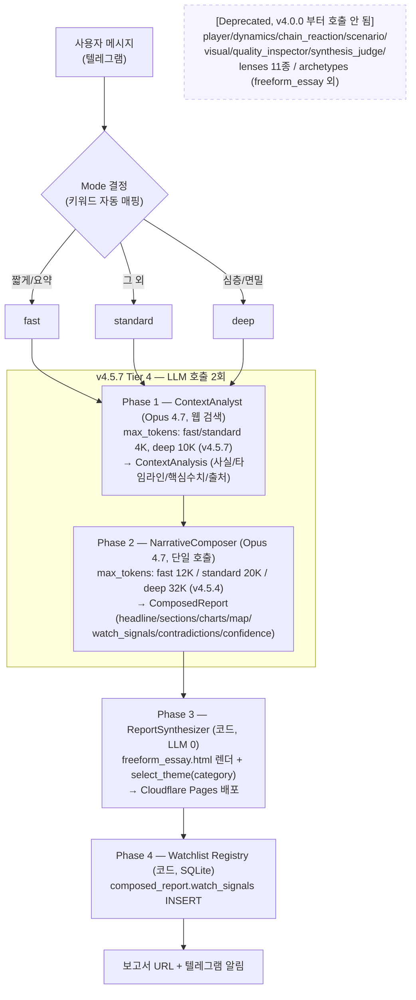
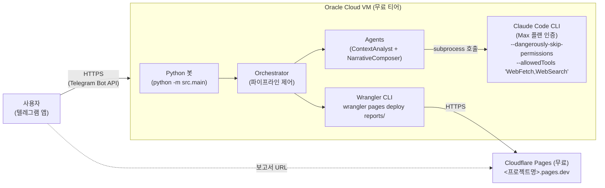
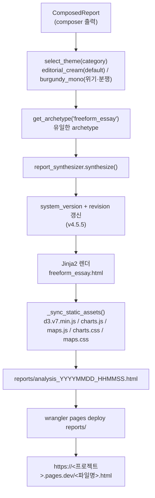
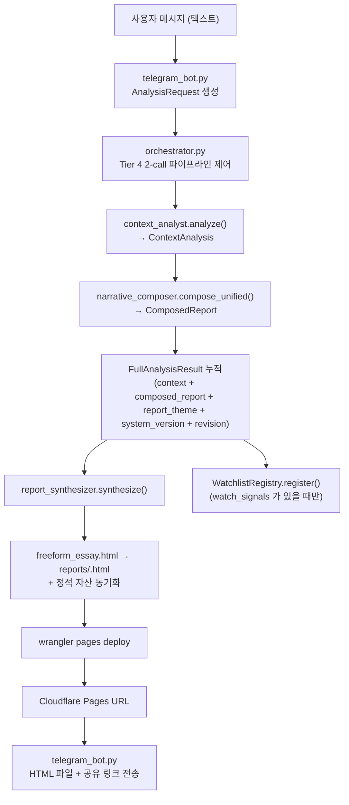
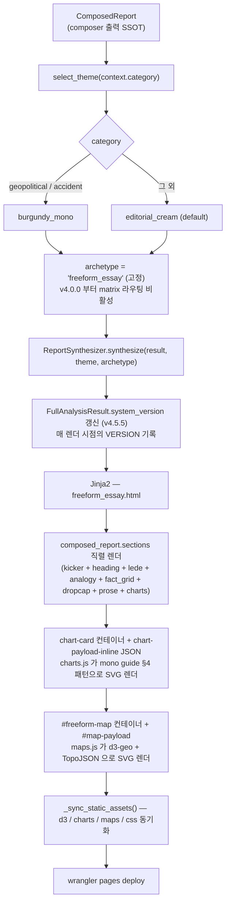
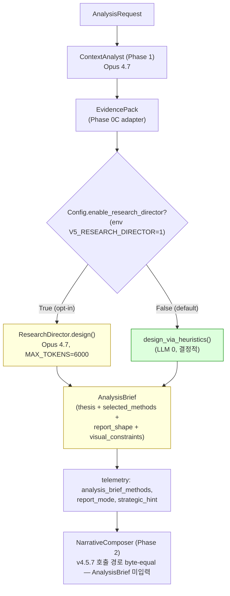

# Event Analysis Team — Architecture (v4.5.7)

> 시스템 아키텍처의 SSOT. 다이어그램·데이터 흐름·기술 스택을 한곳에 정리한다.
> 에이전트·렌즈·블록 카탈로그는 [docs/CATALOGS.md](CATALOGS.md), 데이터 모델 도식은 [docs/DATA_MODELS.md](DATA_MODELS.md). v3 시대의 7-agent / 11-lens / 11-archetype / 5-gate 구조 설명은 본 문서 §10 (Deprecated History) 와 [docs/legacy/](legacy/) 로 분리되어 있다.

> **V5 리팩토링 진행 중.** [REFACTOR_V5_PLAN.md](../REFACTOR_V5_PLAN.md) 가 v5.0.0 의 4-Tier 17-Phase 로 v4.5.7 의 14개 잔존 결함을 수술한다. 본 문서는 *현재 v4.5.7 baseline* 의 SSOT 로, V5 의 신규 Phase 가 도입되면 §11 의 V5 Roadmap 섹션과 본문이 함께 갱신된다.

---

## 1. Current Pipeline (v4.5.7 Tier 4 — 2-call)



**LLM 호출 수**: 모든 모드 (fast/standard/deep) 동일하게 **2회**.
**mode 의 의미**: composer 프롬프트의 분석 깊이 지시 (섹션 수, 모순 명시 강도, 시나리오 개수) + max_tokens 한도 (v4.5.4 의 `MAX_TOKENS_BY_MODE`, v4.5.7 의 ContextAnalyst 분기) 결정. 호출 개수에 영향 없음.

> v3.x 의 7-agent + 11-lens + 11-archetype + 5-gate 멀티 파이프라인은 **v4.0.0 부터 호출되지 않는다**. 모듈은 보존하되 (cleanup commit 미정) 본 문서에서는 §10 Deprecated History 로만 다룬다. v3 시대의 SSOT 문서는 [docs/legacy/](legacy/) 로 이전되었다.

---

## 2. 인프라 구성



비용은 Oracle Cloud 무료 티어 + Claude Max 플랜 + Cloudflare Pages 무료로 0원. 자세한 인프라 설치·운영 절차는 [DEVLOG.md](../DEVLOG.md) 참조.

---

## 3. 분석 파이프라인 (Phase 별 상세)

### 3.1 Phase 1 — ContextAnalyst (Opus 4.7, 웹 검색)

| 항목 | 값 |
|------|-----|
| 모델 | `claude-opus-4-7` (v4.1.0 부터 — Sonnet 4.6 폐기) |
| 호출 방식 | Claude Code CLI subprocess 또는 Anthropic API |
| 검색 | WebFetch / WebSearch 허용 |
| max_tokens | fast 4096 · standard 4096 · deep 10000 (v4.5.7 — `BaseAgent._max_tokens_override`) |
| 입력 | `AnalysisRequest` (event_description, chat_id, mode) |
| 출력 | `ContextAnalysis` (event_name, category, summary, timeline, key_figures, sources, recommended_persona) |
| 책무 | 사건의 사실 / 타임라인 / 핵심 수치 / 출처 URL 만 수집. 분석 / 결론 / 시나리오는 *작성하지 않는다*. |

v4.1.0 에서 ContextAnalyst 가 Opus 4.7 로 상향된 이유는 *2-call 파이프라인에서 context 가 composer 가 보는 유일한 사실 입력* 이기 때문이다. 사실 추출 품질 = 보고서 품질의 상한.

### 3.2 Phase 2 — NarrativeComposer (Opus 4.7, 단일 호출)

| 항목 | 값 |
|------|-----|
| 모델 | `claude-opus-4-7` |
| 호출 방식 | Claude Code CLI subprocess 또는 Anthropic API |
| max_tokens | fast 12000 · standard 20000 · deep 32000 (v4.5.4 — `MAX_TOKENS_BY_MODE`) |
| 입력 | `ContextAnalysis` + mode |
| 출력 | `ComposedReport` (headline, deck, sections[], charts[], embedded_map, watch_signals[], contradictions[], confidence_score, confidence_summary, closing) |
| 책무 | 행위자 / 구조 / 시나리오 / 모순 분석 + 보고서 본문 작성 + 감시 신호 추출 + 차트 데이터 + 지도 데이터를 *단일 LLM 호출* 로 모두 결정한다. |

**mode 의 prompt 영향**: fast 3~4 섹션 / standard 4~6 섹션 / deep 5~7 섹션 + 모순 명시 필수 + 시나리오 다수.

**composer 가 emit 하는 것**:
- `ComposedSection.charts: list[dict]` — 8종 type (`bar / donut / line / gantt / network / stacked / bubble / heatmap`). 각 차트는 `{type, title, data, note?}` 형식. 빈 데이터면 차트 없음.
- `ComposedReport.embedded_map: dict | None` — 보고서당 1개 (지리적 사건일 때만). `{center, zoom, markers, arcs, legend?}`.

### 3.3 Phase 3 — ReportSynthesizer (코드, LLM 0)



`freeform_essay.html` 이 v4.5.7 의 *유일하게 사용되는* 보고서 템플릿이다. v3 시대의 11종 archetype 템플릿은 보존되어 있으나 호출되지 않는다.

### 3.4 Phase 4 — Watchlist Registry (코드, SQLite)

`composed_report.watch_signals` 가 비어 있지 않으면 `WatchlistRegistry.register()` 가 SQLite 에 INSERT 한다.
- 봇 프로세스 내 asyncio monitor (1h 주기) 가 `deadline` 도래 시 auto-fire (ambiguous direction) + 텔레그램 알림.
- `/watchlist` 명령으로 활성 신호 조회, `/fire` 로 수동 발화.

자세한 데이터 모델은 [docs/DATA_MODELS.md](DATA_MODELS.md), 카탈로그는 [docs/CATALOGS.md](CATALOGS.md).

---

## 4. Mode Routing + 토큰 정책 (v4.5.7)

### 4.1 Mode 결정 규칙
- 사용자 메시지에 `짧게` / `간략히` / `간략하게` / `빠르게` / `요약` / `간단히` / `간단하게` / `fast` 키워드 → **fast**
- 사용자 메시지에 `심층` / `깊게` / `자세히` / `정밀` / `면밀` / `상세하게` / `deep` 키워드 → **deep**
- 둘 다 있으면 deep 우선
- 그 외 → **standard** (default)

### 4.2 Mode 별 max_tokens (현재 baseline)

| Mode | ContextAnalyst (v4.5.7) | NarrativeComposer (v4.5.4) |
|------|-------------------------|----------------------------|
| fast | 4096 | 12000 |
| standard | 4096 | 20000 |
| deep | 10000 | 32000 |

SSOT 는 [src/agents/context_analyst.py](../src/agents/context_analyst.py) 와 [src/agents/narrative_composer.py:MAX_TOKENS_BY_MODE](../src/agents/narrative_composer.py).

### 4.3 토큰 사용량 (분석 1건당 추정)

| Mode | v4.0.0 | v4.5.7 (현재) | V5 (압축 후 추정) |
|------|--------|---------------|-------------------|
| fast | ~16K | ~16K | ~28K (+75%) |
| standard | ~28K | ~28K | ~50K (+79%) |
| deep | ~42K | ~42K | ~70K (+67%) |

V5 비용 추정의 SSOT 는 [REFACTOR_V5_PLAN.md §21](../REFACTOR_V5_PLAN.md). v4.0.0 의 ~85% 절감 효과 (deep 13콜 → 2콜) 는 v4.5.7 까지 보존된다.

---

## 5. 데이터 흐름



모든 에이전트 간 통신은 Pydantic 모델 (raw dict 금지). 모델 정의 SSOT 는 `src/models.py`, 도식은 [docs/DATA_MODELS.md](DATA_MODELS.md).

---

## 6. 보고서 생성 흐름 (v4.5.7 freeform_essay 단일 경로)

`select_archetype(strategy)` 의 4-tier 우선순위 매트릭스 + 하이브리드 라우팅은 v4.0.0 부터 *비활성*. 현재는 항상 `get_archetype("freeform_essay")` 로 라우팅된다.



### 6.1 Editorial 인터랙션 컴포넌트 (v4.5.0 부터)

`ComposedSection` 에 v4.5.0 에서 추가된 4종 필드:
- `lede` — 1~3문장 도입 (italic, prose 위 큰 글씨)
- `analogy` — `{title, body}` 비유 박스 (어려운 개념을 일상 비유로)
- `fact_grid` — `[{label, value, sublabel?}]` 핵심 수치 격자. v4.5.2 부터 `data-cols` 한 줄 강제.
- `dropcap` — bool, prose 첫 글자 dropcap 렌더 (보고서당 1~2 섹션 권장)

자동 TOC — 섹션 ≥ 2개일 때 hero 직후 자동 생성. 섹션 anchor (`#sec-N`) 자동 부여.

### 6.2 보고서 추적성 (v4.5.5)

`FullAnalysisResult.system_version` (str) 과 `revision` (int = 0) 이 hero eyebrow 에 표기된다.
- `system_version` 은 매 렌더 (신규 / 재렌더 모두) 시점의 `orchestrator.VERSION` 으로 갱신.
- `revision` 은 최초 0, `patch_report.py` 의 mutate 또는 `--edit` 시 +1.
- v4.5.6 부터 `Rev 0` 도 항상 표기 ("Analysis Team v4.5.5 · Rev 0" 형식).

---

## 7. 차트·지도 시스템 (v4.5.7 — composer-emitted)

차트와 지도의 디자인 SSOT 는 [docs/MONO_THEME_GUIDE.md](MONO_THEME_GUIDE.md). 회귀 anti-pattern SSOT 는 [docs/CHART_RENDERING_ANTIPATTERNS.md](CHART_RENDERING_ANTIPATTERNS.md) (14개 누적).

### 7.1 차트 — 8종 type (composer 직접 emit)

| Type | data 스키마 | 적용 사건 |
|------|-------------|-----------|
| `bar` | `[{label, value, group?}]` | 항목별 비교, 카테고리 분포 |
| `donut` | `[{label, value}]` | 비중 / 점유율 |
| `line` | `{x: [], series: [{name, values}]}` | 시계열, 추세 |
| `gantt` | `[{label, start, end, note?}]` | 일정 비교, 단계별 구간 (v4.5.4 시간축 자동 + note placement) |
| `network` | `{nodes, links}` | 행위자 관계 (force-directed) |
| `stacked` | `{categories, series}` | 누적 분포, 다층 비교 |
| `bubble` | `[{x, y, size, label}]` | 영향 × 확률 매트릭스 (v4.5.3 스케일 자동 감지) |
| `heatmap` | `[{x, y, value}]` | 매트릭스 강도 |

각 차트는 `ComposedSection.charts` 의 dict 1개 (`{type, title, data, note?}`). 빈 데이터면 차트 없음. composer 가 *수치 비교가 본문 이해에 결정적일 때만* 보수적으로 emit 한다.

**렌더링 흐름**: `freeform_essay.html` 이 chart-card SVG 컨테이너 + inline JSON payload 를 emit → `charts.js` 가 페이지 로드 시 모든 `<script class="chart-payload-inline">` 를 스캔 → `RENDERERS[type]` 로 dispatch → mono guide §4 패턴 자동 적용 (hatch-tight / hatch-wide / dots / accent-hatch + accent solid).

### 7.2 지도 (composer.embedded_map)

- composer 가 보고서당 1개 emit (지리적 사건일 때만). 빈 값이면 지도 섹션 없음.
- 베이스맵 — `d3 + d3-geo + topojson.feature(world-atlas/110m)`. maplibre-gl 의존은 v4.2.0 부터 폐기.
- 외부 타일 서비스 / 글리프 PBF 호출 금지 (mono guide §2.2). world-atlas 한 번 fetch (~100KB) 후 캐시.
- `maps.js` 가 `#freeform-map` 컨테이너 + `#map-payload` 스크립트 읽어 SVG 렌더.
- v4.4.6 — d3.zoom() pan/zoom + 컨트롤 버튼 + 소말릴란드 (de facto) 45° 해칭 폴리곤.
- v4.5.7 — 무관한 지리 annotation (Somaliland 등) 은 `path.bounds()` viewport 교집합 검사 후 gate (CHART-AP-14). 호르무즈·동북아 같은 무관 보고서에서 polygon + legend 모두 skip.

### 7.3 정적 자산 동기화

`report_synthesizer._sync_static_assets()` 가 보고서 생성 시 다음을 reports/ 디렉토리로 복사 (size+mtime 기반 idempotent):
- `d3.v7.min.js` (~274KB)
- `charts.js` + `charts.css`
- `maps.js` + `maps.css`

Cloudflare Pages 가 CDN 캐시.

---

## 8. 기술 스택 (v4.5.7)

| 영역 | 기술 | 비고 |
|------|------|------|
| 언어 | Python 3.11+ | async/await, type hints |
| AI 모델 | `claude-opus-4-7` (composer + context, v4.1.0 부터 일관) | claude-sonnet-4-6 보존 (legacy 코드 경로) |
| AI 호출 | Claude Code CLI (Max 플랜 인증) 또는 Anthropic API | subprocess `--dangerously-skip-permissions --allowedTools "WebFetch,WebSearch"` |
| 메시징 | python-telegram-bot | 비동기 텔레그램 봇 |
| 데이터 검증 | Pydantic v2 | 모든 데이터 모델 (raw dict 금지) |
| 보고서 템플릿 | Jinja2 | freeform_essay.html 단일 |
| 차트 | d3 v7 SVG | composer-emitted inline data, 8종 type, mono guide §4 패턴 |
| 지도 | d3 + d3-geo + world-atlas/110m TopoJSON | maplibre-gl 폐기 |
| 테마 | editorial_cream (default) / burgundy_mono (위기·분쟁) | v4.5.0 부터 — `lens_policy.select_theme(category)` 라우팅 |
| 폰트 | Newsreader (display serif, 영문/숫자) + IBM Plex Sans KR (본문) + IBM Plex Mono (수치) | Noto Serif KR 한국어 폴백 |
| 호스팅 | Cloudflare Pages | wrangler CLI 배포 |
| 서버 | Oracle Cloud VM | 무료 티어, Ubuntu 22.04 |
| Watchlist | SQLite | `src/watchlist/` — register/monitor/fire |

---

## 9. 에이전트 통신 규약

- 모든 에이전트 간 통신은 Pydantic 모델 (raw dict 금지, Anti-pattern #3 회피).
- 오케스트레이터가 `FullAnalysisResult` 객체를 들고 각 단계 결과를 누적.
- 각 에이전트는 입력을 typed 로 받아 typed output 을 반환.
- Claude CLI 호출 시 `--dangerously-skip-permissions --allowedTools "WebFetch,WebSearch"`.
- composer 호출 실패 시 graceful fallback — context.summary 만으로 minimal `ComposedReport` 구성 (`orchestrator.py:run_analysis()` 내).

---

## 10. Deprecated History (v3 시대 — 호출되지 않음, 코드 보존)

> 본 섹션은 *역사적 참고용* 이다. v4.0.0 부터 호출되지 않는 모듈·구조의 설명을 보존한다. 코드 자체는 보존되어 있으나 (cleanup commit 미정), 본 문서가 묘사하는 "현재 동작" 은 §1~9 가 SSOT 다.

### 10.1 v3.x 시대의 7-agent + 11-lens + 11-archetype + 5-gate 파이프라인

```
사용자 메시지 → mode 결정 → ContextAnalyst → Strategy Planner (축약) +
🛡 Quality Gate 1 → lens pool (mode 별 cap 1/2/4) + (deep 만) v2 페르소나 →
시나리오 → 결정적 시각화 → SynthesisJudge (heuristic-first) +
🛡 Quality Gate 2 → archetype 11종 중 matrix 결정 → HTML 보고서 →
Cloudflare 배포 → 공유 링크 + Watchlist 영구 저장
```

### 10.2 v3.x 시대의 호출 순서 (참고)

```
Phase 1   ① 상황인식 분석관 → ContextAnalysis
Phase 1.5 [V3 Step 4] 🛡 Quality Gate 1 — Plan Sanity
Phase 2   ② PlayerAnalyst → PlayerAnalysis
          ③ DynamicsAnalyst → DynamicsAnalysis
Phase 3   ④ ChainReactionAnalyst → ChainReactionAnalysis
          ⑤ ScenarioArchitect → ScenarioAnalysis
Phase 3.5 ⑥ VisualAnalyst → VisualAnalysis
Phase 3.7 [V3 Step 4] orchestrator._wrap_findings() → list[AnalyticalFinding]
Phase 3.75 [V3 Step 5-A/5-C] 🔬 _run_lenses() — Lens Pool (cap 4)
Phase 3.8 [V3 Step 4] 🧮 SynthesisJudge.judge(findings) → JudgmentVerdict
Phase 3.9 [V3 Step 4] 🛡 Quality Gate 2 — Coverage Check
Phase 3.95 [v3.3.0] ✍️ NarrativeComposer (deep 모드만)
Phase 4   ⑦ ReportSynthesizer → Jinja2 → HTML → Cloudflare Pages
Phase 4.5 [V3 Step 5-B] 📒 Watchlist Registry
```

이 구조의 SSOT 였던 [REFACTOR_V3_PLAN.md](legacy/REFACTOR_V3_PLAN.md) 는 [docs/legacy/](legacy/) 로 이전되었다 (Phase 0 SSOT Repair).

### 10.3 호출되지 않는 모듈 (v4.0.0 부터)

- `src/agents/{player_analyst, dynamics_analyst, chain_reaction_analyst, scenario_architect, visual_analyst, quality_inspector, synthesis_judge}.py`
- `src/lenses/` — 11종 전부
- `src/archetypes/` — `freeform_essay` 외 11종
- `src/visual_builder.py:build_chart_payload()` / `build_map_payload()` — composer 직접 emit 으로 대체 (v4.2.0)
- `src/templates/{report.html, report_block.html}` — legacy archetype 용
- `src/templates/blocks/` 17종 — composer 가 `embedded_blocks` 로 명시 시만 사용 (현재 실질 미사용)

이 모듈들은 *호출되지 않을 뿐* 코드는 보존된다. 부분 import 가 남아있어 `orchestrator.py` 의 import 블록에는 여전히 등장하지만 v4.5.7 의 호출 경로에서는 인스턴스화만 되고 실제 메서드는 발화되지 않는다.

---

## 11. V5 Roadmap — 진행 상황 (참조용 요약)

[REFACTOR_V5_PLAN.md](../REFACTOR_V5_PLAN.md) 가 V5 마스터 플랜의 SSOT. 본 섹션은 ARCHITECTURE 관점에서의 *현재 진행 상황 요약* 이다.

| Tier | 포함 Phase | 핵심 변경 | 본 ARCHITECTURE.md 영향 |
|------|-----------|-----------|--------------------------|
| Tier 1 — 토대 | Phase 0, 0B, 0C, 1A, 2A | SSOT Repair, Golden Eval Harness, State Compaction, ResearchDirector, EvidenceDataset | §1 의 2-call 다이어그램이 *3-call (Context → Director → Compose)* 로 확장 |
| Tier 2 — 시각 스택 | Phase 2, 2B, 6, 6A, 7A | Vega-Lite, Capability Registry, 4중 Chart Gate, Exhibit Priority, Deterministic Publish Gate | §7 의 차트·지도 시스템이 8종 enum → open-ended (capability-bounded) 로 확장 |
| Tier 3 — 시스템 QA + 모드 분기 | Phase 7, 8, 8A | DeskEditor (publish/hold/KILL), Strategic Mode | §3 에 Phase 7 (DeskEditor + Playwright 캡쳐) 추가, §1 에 Strategic Mode 분기 |
| Tier 4 — 미적 개선 | Phase 1, 3, 4, 5 | Editor Pass, Layout Primitives, Exhibit 번호제, Word Budget + 절단 검출 | §6 의 freeform_essay 단일 → 9종 layout primitive |

**현재 단계** — Tier 1 의 Phase 0C 완료 (Phase 0 + 0B + 0C). 본 문서가 v4.5.7 baseline 으로 갱신된 시점부터 다음 사항이 누적되었다.

- **Phase 0** ([REFACTOR_V5_PLAN.md §2](../REFACTOR_V5_PLAN.md)) — 문서·코드 SSOT 정합성 회복 (코드 변경 0).
- **Phase 0B** ([§3](../REFACTOR_V5_PLAN.md)) — Golden Prompt 20건 + 5종 회귀 테스트 framework. SSOT: [tests/regression/README.md](../tests/regression/README.md).
- **Phase 0C** ([§4](../REFACTOR_V5_PLAN.md)) — 6-tier State 모델 (`src/state/`) + RawContext → EvidencePack 변환 + 단계별 입력 강제 규칙 (AP-V5-30). v4.5.7 호출 경로는 byte-equal 보존. `orchestrator.run_analysis` 에 EvidencePack adapter 가 *telemetry 전용* 으로 삽입됨.
- **Phase 1A** ([§6](../REFACTOR_V5_PLAN.md)) — `ResearchDirector` (`src/agents/research_director.py`) + 9종 분석기법 enum 활성 + SYSTEM_PROMPT (§6.4) + 결정적 fallback `design_via_heuristics`. orchestrator 가 `Config.enable_research_director` opt-in flag (`V5_RESEARCH_DIRECTOR=1`) 로 ResearchDirector 호출 — 디폴트 OFF 라 v4.5.7 호출 경로는 byte-equal 보존. 꺼진 환경에서도 `design_via_heuristics` 가 *모든 사건에* AnalysisBrief emit (Plan §6.6 #1 충족). Golden Prompt 20건 expected_method 일치률 90% (≥80% 임계 통과). SSOT: [docs/RESEARCH_DIRECTOR_METHODS.md](RESEARCH_DIRECTOR_METHODS.md).
- **Phase 2** ([§7](../REFACTOR_V5_PLAN.md)) — Visualization Decoupling. `src/visual/v5_theme.py` (Plan §19 design token SSOT — Editorial Cream + Burgundy Mono + 폰트 트리플렛) + `src/visual/vega_adapter.py` (`render_vega_lite()` 단일 어댑터, vl-convert-python optional + spec-only fallback) + `src/agents/visual_planner.py` (opt-in flag `V5_VISUAL_PLANNER=1`). v4.5.7 호출 경로 byte-equal 보존 — VisualPlanner 가 꺼져 있으면 composer 의 chart emit 그대로 통과. Plan §7.7 의 13개 antipattern 중 *Vega-Lite 자동 해결 8개* 항목 (AP-1/2/3/4/9/11/12/13) 가 회귀 테스트로 검증.
- **Phase 2A** ([§8](../REFACTOR_V5_PLAN.md)) — `EvidenceDataset` 강화 (`DatasetField` semantic_type 7종 + `TransformStep` 변환 추적) + `src/visual/evidence_dataset.py` 신설. `EvidenceDatasetGuard` 가 차트 emit 시 Plan §8.5 의 3개 금지 행위 (AP-V5-24 prose 부산물 / AP-V5-25 출처 없는 synthetic / AP-V5-26 source_id 없는 chart) 를 결정적 차단. ChartCritic (Phase 6) 의 질문 8 (prose 인용 가드) 사전 구현 — 차트 수치 ≥20% prose 인용 강제. Phase 6 진입 시 VisualPlanner 와 결합되어 본격 활성.

### V5 6-tier State 모델 (Phase 0C 도입, [src/state/](../src/state/))

```mermaid
flowchart LR
    REQ["AnalysisRequest"] --> RAW["1. RawContext<br/>(user_request +<br/>raw_sources + search_results)"]
    RAW -->|"ContextAnalyst"| EP["2. EvidencePack<br/>(claims + actors +<br/>timeline + contradictions)"]
    EP -->|"ResearchDirector<br/>(Phase 1A)"| AB["3. AnalysisBrief<br/>(thesis + selected_methods +<br/>report_shape + visual_constraints)"]
    AB -->|"Composer"| DR["4. DraftReport<br/>(headline + sections + closing)"]
    DR -->|"VisualPlanner<br/>(Phase 2)"| EXP["5. ExhibitPack<br/>(EvidenceDataset[] + chart_specs +<br/>layouts)"]
    EXP -->|"Renderer"| PM["6. PublishManifest<br/>(rendered_html_path +<br/>screenshots + chart_gate_results)"]
    PM -->|"DeskEditor<br/>(Phase 7)"| OUT["PUBLISH / HOLD / KILL"]

    style RAW fill:#fde,stroke:#a06
    style EP fill:#efe,stroke:#0a6
    style AB fill:#ffd,stroke:#a80
    style DR fill:#dff,stroke:#06a
    style EXP fill:#fed,stroke:#860
    style PM fill:#dfd,stroke:#080
```



### V5 Phase 1A — ResearchDirector 흐름 (현재 opt-in)



ResearchDirector 의 역할 = *기자 데스크의 사전 지시*. Composer 가 분석기법을 *암묵적으로* 결정하던 v4.5.7 의 결함 (GAP-11) 을 차단. 9종 method enum SSOT: [docs/RESEARCH_DIRECTOR_METHODS.md](RESEARCH_DIRECTOR_METHODS.md). Phase 1A 시점은 *AnalysisBrief 가 telemetry 에만 emit* — Composer 입력 형태 변경은 후속 Phase (Tier 2~4 진입) 와 결합.

**입력 제한 강제 규칙** ([src/state/guards.py](../src/state/guards.py), Plan §4.4):

| 단계 | 받는 state | 받지 못하는 state |
|------|-----------|-------------------|
| ContextAnalyst | RawContext | — |
| ResearchDirector (Phase 1A) | EvidencePack + user_request | RawContext |
| Composer | AnalysisBrief + EvidencePack 의 *압축 요약* | RawContext, 출처 원문 전체 |
| VisualPlanner (Phase 2) | DraftReport + EvidenceDataset[] + visual_constraints | RawContext, raw web snippets |
| Editor (Phase 1) | DraftReport + AnalysisBrief 의 thesis/critique 만 | RawContext, EvidencePack 전체 |
| LayoutTypesetter (Phase 3) | DraftReport + ExhibitPack | RawContext, EvidencePack |
| ChartCritic (Phase 6 Gate B) | 단일 chart spec + 인접 prose + thesis | 다른 차트, RawContext |
| DeskEditor (Phase 7) | PublishManifest + DraftReport (final) + screenshots | RawContext, raw EvidencePack |

위 규칙 위반은 **AP-V5-30** 회귀이며, `tests/regression/test_state_compaction.py` 가 검증.

---

## 12. Out of scope (이 문서가 다루지 않는 것)

- 에이전트별 상세 역할 → [docs/CATALOGS.md](CATALOGS.md)
- Pydantic 모델 정의 → `src/models.py` (도식만 [docs/DATA_MODELS.md](DATA_MODELS.md))
- 인프라 설치 절차 → [DEVLOG.md](../DEVLOG.md)
- 분석 명령 사용법 → [WORKFLOWS.md](../WORKFLOWS.md)
- 차트·지도 디자인 토큰 → [docs/MONO_THEME_GUIDE.md](MONO_THEME_GUIDE.md)
- 차트 / 보고서 anti-pattern 카탈로그 → [docs/CHART_RENDERING_ANTIPATTERNS.md](CHART_RENDERING_ANTIPATTERNS.md), [docs/REPORT_WRITING_ANTIPATTERNS.md](REPORT_WRITING_ANTIPATTERNS.md)
- V5 리팩토링 마스터 플랜 → [REFACTOR_V5_PLAN.md](../REFACTOR_V5_PLAN.md)
- v3 시대 SSOT — [docs/legacy/](legacy/) (REFACTOR_V3_PLAN.md 등)
