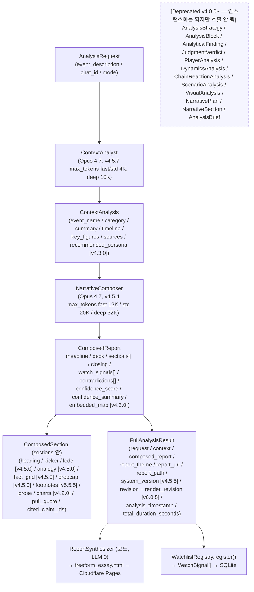

<!-- v5.5.5: ComposedSection 에 footnotes: list[{term, explanation}] 추가 (전문
     용어 문단 하단 주석 — 일반 독자 우선 최우선 가치). WRITE-AP-10. -->
<!-- v5.5.1: ComposedReport 에 contradictions_heading: str 추가 (모순 섹션 동적
     제목, composer emit, 비면 '쟁점과 판단' fallback). WRITE-AP-9. -->
<!-- v5.5.2: ComposedReport.timeline_flow: dict|None (시간 흐름도 composer 윤색,
     선택). 조립 SSOT = src/timeline_flow.py. ReportBundle.timeline =
     BundleTimeline{heading, points:[{date,label,phase,note}]} (additive). -->


# Data Models — Pydantic Schema Map

> **이 문서는 도식이다. 필드 정의는 `src/models.py` 가 SSOT.**
> 새 필드를 *정의*하지 않는다. 코드에 추가한 후 본 문서의 도식만 갱신한다 (Anti-pattern 9 회피).

---

## 1. 모델 관계도 (v4.5.7 Tier 4 — 실제 호출 경로)



v4.5.7 의 *실제* 데이터 흐름은 `AnalysisRequest → ContextAnalysis → ComposedReport → FullAnalysisResult` 의 단순 4-노드 체인이다. v3 시대의 `AnalysisStrategy → 6개 분석 모델 → AnalyticalFinding → JudgmentVerdict → AnalysisBlock` 흐름은 v4.0.0 부터 호출되지 않으며, 모델 정의는 보존하되 인스턴스가 채워지지 않는다.

`FullAnalysisResult` 는 v3 시대의 optional 필드 (`strategy`, `players`, `dynamics`, `chain_reaction`, `scenarios`, `visuals`, `findings`, `judgment`, `blocks`) 를 **호환 목적으로 보존** 하지만, 현재 호출 경로에서는 채워지지 않는다.

---

## 2. 모델 목록 (현재 v4.5.7)

**Active (v4.5.7 호출 경로 안)** — composer 와 renderer 가 실제로 채우거나 참조하는 모델.

| 모델 | 책무 | 정의 위치 |
|------|------|-----------|
| `AnalysisRequest` | 사용자 요청 (텔레그램 메시지 → 모델). event_description / chat_id / mode. | `src/models.py` |
| `ContextAnalysis` | ContextAnalyst (Opus 4.7) 출력. event_name / category / summary / timeline / key_figures / sources / instruments_mentioned / time_series / **`provenance: list[dict]` (v6.0.0 Phase V6-8 — 각 사실의 source_date/scope_note/source_url, additive·Optional, `V6_PROVENANCE` 시 채움)** | `src/models.py` |
| `ComposedSection` | composer 가 짠 1개 자유 섹션. heading / kicker / prose / **`charts: list[dict]` (v4.2.0)** / pull_quote / cited_claim_ids / **`lede` / `analogy` / `fact_grid` / `dropcap` (v4.5.0 editorial 4종)** / **`footnotes: list[{term, explanation}]` (v5.5.5 전문 용어 문단 하단 주석)**. legacy `embedded_charts: list[str]` 와 `embedded_blocks: list[str]` 는 보존만. | `src/models.py` |
| `ComposedReport` | NarrativeComposer (Opus 4.7) 단일 호출 산출. headline / deck / sections / closing / **(v4.0.0) watch_signals + contradictions + confidence_summary + confidence_score + (v4.2.0) embedded_map**. v4.0.0 부터 보고서 SSOT. | `src/models.py` |
| `FullAnalysisResult` | 모든 결과 + 메타데이터 컨테이너. request / context / composed_report / report_url / report_path / report_theme / **(v4.5.5) system_version + revision** / analysis_timestamp / total_duration_seconds. v3 시대 optional 필드 (strategy / blocks / findings / judgment / players / dynamics / chain_reaction / scenarios / visuals) 는 호환 목적으로 보존되나 v4.5.7 호출 경로에서는 채워지지 않는다. | `src/models.py` |
| `WatchSignal` | 감시 신호 — signal_id / description / measurement / direction / deadline / parent_chat_id / fired / fired_at. `WatchlistRegistry` (SQLite) 에 영구 저장 (Anti-pattern #11). composer 의 `composed_report.watch_signals: list[dict]` → `convert_watch_signals()` 변환. | `src/models.py` |
| `WatchDirection` (Literal) | confirms_base / rejects_base / ambiguous (V3 Step 5-B 도입, v4.5.7 도 동일). | `src/models.py` |

**V6 Phase V6-1 (opt-in, `V6_CODEX_CRITIC` default OFF)** — Codex 외부 critic 의 verdict 계약. flag OFF 시 인스턴스화 안 됨 (byte-equal). 상세는 §3.15.

| 모델 | 책무 | 정의 위치 |
|------|------|-----------|
| `CritiqueClaim` | Codex 가 emit 하는 per-claim 구조화 지적. location / error_class / quote / evidence_conflict / source_urls / fix_instruction / severity. AP-V6-8 — 근거 없는 지적은 모델 validation 이 거부. | `src/models.py` |
| `FactVerdict` | Codex critic 의 보고서 단위 verdict. verdict_status (clean/violations/skipped) / claims / cited_urls / model_label / skipped + skip_reason / latency_ms / truncation_repaired. degrade 시 `FactVerdict.skip(...)` → 단일패스 (AP-V6-12). | `src/models.py` |

**Deprecated (정의는 보존되나 v4.5.7 호출 경로에서 인스턴스화/사용 안 됨)** — v3 시대의 7-agent + 11-lens + 11-archetype + 5-gate 흐름의 모델들. 코드 cleanup 미정.

| 모델 | 마지막 활성 버전 | 비고 |
|------|------------------|------|
| `AnalysisStrategy` | v3.5.0 | Strategy Planner 산출 — v4.0.0 부터 채워지지 않음. `legacy_directives` 는 transitional shim. |
| `EvidenceNeed` | v3.5.0 | Strategy 의 증거 수집 명세. |
| `ReportSectionPlan` | v3.5.0 | archetype.section_plan() 산출. |
| `VisualizationSpec` | v3.5.0 | Visual Analyst 참조. |
| `AnalysisMethodContract` | v3.4.6 | AMC + Narrative DSL — v4.0.0 부터 비활성. |
| `BlockType` (Literal 18종) | v3.4.0 (`map` 추가까지) | composer 가 `embedded_blocks` 로 명시 시만 사용. v4.5.7 에서 실질 미사용. |
| `AnalysisBlock` | v3.5.0 | `_build_blocks()` 가 채우던 단위. v4.0.0 부터 비활성. |
| `Evidence` / `Claim` / `ClaimType` / `Reliability` | v3.5.0 | V3 Step 4 추적성 모델. composer 가 prose 로 통합 처리. |
| `ConfidenceProfile` | v3.5.0 | 3축 분해 신뢰도. v4.0.0 부터 `ComposedReport.confidence_score` 단일 스칼라 + `confidence_summary` 자유 텍스트로 대체. |
| `AnalyticalFinding` | v3.5.0 | lens 단위 결과. |
| `JudgmentVerdict` | v3.5.0 | SynthesisJudge 산출. v4.0.0 부터 `ComposedReport.contradictions` 가 모순 노출 책임 (봉합 금지 정책 보존, Anti-pattern #5). |
| `PlayerAnalysis` / `DynamicsAnalysis` / `ChainReactionAnalysis` / `ScenarioAnalysis` / `VisualAnalysis` | v3.5.0 | 6개 분석 에이전트 출력. v4.0.0 부터 composer 가 단일 호출 안에서 통합 처리. |
| `NarrativeSection` / `NarrativePlan` | v3.5.0 | legacy six_act_theater 흐름 전용. |
| `AnalysisBrief` | v3.1.0 | V3 Step 6 의 compact context 시도. v4.0.0 부터 호출 경로에 없음. |

각 모델의 **현재 필드 목록**은 `src/models.py` 를 직접 읽는다 — 본 문서에 필드 사본을 두면 SSOT 위반이 된다.

---

## 3. 핵심 필드 의미 (분석 산출물 위주)

필드 *정의* 가 아니라, 필드의 *목적*을 사람의 언어로 풀어둔 가이드. 본 섹션은 v4.5.7 호출 경로에서 *실제 채워지는 모델* (Active) 부터 다루고, v3 시대의 deprecated 모델은 §3.99 로 분리한다.

### 3.A ComposedSection (v3.3.0~v4.5.7 — Active SSOT)

composer 가 짠 1개 자유 섹션. `prose` 가 본문이고 시각화 / editorial 컴포넌트는 모두 선택적이다.

- `heading`: 섹션 제목.
- `kicker`: 짧은 도입 라벨 1줄 (생략 가능). 한 줄 라벨 역할.
- `lede` (v4.5.0): 1~3문장 도입. prose 시작 전 큰 글씨 italic. *섹션 흐름 도입 역할* — kicker 와 책임 분리.
- `analogy` (v4.5.0): `{title: str, body: str}` 비유 박스. 어려운 개념을 일상 비유로 풀 때만. 모든 섹션에 박지 않는다.
- `fact_grid` (v4.5.0): `[{label, value, sublabel?}]` 핵심 수치 격자. v4.5.2 부터 `data-cols` 한 줄 강제 — wrap 없음.
- `dropcap` (v4.5.0): True 시 prose 첫 글자 dropcap. 보고서당 1~2 섹션 권장 (남용하면 시각 피로).
- `prose`: 본문 — 마크다운 단락 자유.
- `footnotes` (v5.5.5): `[{term, explanation}]` 전문 용어 주석. 일반 독자 우선 = 시스템 최우선 가치 (REPORT_STYLE_GUIDE §0.1). composer 가 평이한 우리말로 못 바꾼 *핵심 용어만* emit → `freeform_essay.html` 이 prose 직후 "용어 풀이" 블록 (`.freeform-footnotes`) 으로 *문단 하단* 렌더. None/비정형 항목은 validator 가 정규화·drop.
- `charts` (v4.2.0): `list[dict]` — `[{type, title, data, note?}]`. 8종 type (`bar / donut / line / gantt / network / stacked / bubble / heatmap`). composer 가 *수치 비교가 본문 이해에 결정적일 때만* 보수적으로 emit.
- `pull_quote`: 강조 인용 (선택).
- `cited_claim_ids`: claim 추적성 보존용 (legacy V3 Step 4 호환).
- `embedded_blocks` / `embedded_charts`: legacy v3.x 의 chart-id / block-type 참조. v4.2.0 부터 의미 잃었으나 호환 목적으로 보존.

### 3.B ComposedReport (v3.3.0~v4.5.7 — Active SSOT, 보고서의 단일 진실)

NarrativeComposer (Opus 4.7) 의 단일 호출 산출. v4.0.0 부터 `freeform_essay.html` 이 이를 직접 렌더한다.

- `headline`: 보고서 제목.
- `deck`: 부제 1~2문장 (선택).
- `sections`: `list[ComposedSection]` 본문 섹션들.
- `closing`: 에필로그 (선택). v4.5.4 의 절단 검출 (REFACTOR_V5_PLAN.md Phase 5) 이 본 필드 비어 있음을 체크.
- `watch_signals` (v4.0.0): `list[dict]` — `[{signal, description, indicates, deadline?, icon?}]`. WatchlistRegistry 가 SQLite 에 등록.
- `contradictions` (v4.0.0): `list[dict]` — `[{side_a, side_b, evidence?, resolution?}]`. **봉합 금지** (Anti-pattern #5) 보존.
- `confidence_summary` (v4.0.0): 신뢰도에 대한 한 줄 자유 텍스트. v3 시대의 `ConfidenceProfile` 3축 분해를 1줄 prose 로 단순화.
- `confidence_score` (v4.0.0): 0.0~1.0 종합 신뢰도. composer 자체 평가.
- `embedded_map` (v4.2.0): `dict | None` — 보고서당 1개 (지리적 사건일 때만). `{center, zoom, markers, arcs, legend?}`. 빈 값이면 지도 섹션 없음.

### 3.C FullAnalysisResult (v4.5.7 메타데이터 컨테이너)

오케스트레이터가 들고 다니는 결과 컨테이너.

- `request: AnalysisRequest`: 원 요청.
- `context: ContextAnalysis | None`: Phase 1 출력.
- `composed_report: ComposedReport | None`: Phase 2 출력. v4.0.0 부터 보고서 SSOT.
- `report_url`, `report_path`: Phase 3 산출 — 배포된 URL 과 로컬 HTML 경로.
- `report_theme`: `lens_policy.select_theme(category)` 결과 (`editorial_cream` 또는 `burgundy_mono`).
- `executive_summary`: composer 의 `deck` 또는 `headline` (markdown index 공통 텍스트).
- `system_version` (v4.5.5): 매 렌더 시점의 `orchestrator.VERSION`. 재렌더 시엔 *재렌더 시점* 으로 갱신.
- `revision` (v4.5.5): **내용/데이터 수정 횟수 (정수부)**. 0 = 최초 생성, 1+ = patch_report.py 의 데이터 변경 패치(--replace/--add-footnote/--edit/--recompose 등). v4.5.6 부터 0 도 항상 hero eyebrow 에 표기.
- `render_revision` (v6.0.5): **표현/레이아웃 수정 횟수 (소수부)**. 내용은 그대로 두고 양식·차트 레이아웃·정적 자산(charts.js 등)만 바뀐 `--rerender-only` 마다 +1. 데이터(정수부) 변경 시 0 리셋. 구 보고서 JSON 엔 없음 → 기본 0 (하위호환).
- `revision_label` (property, v6.0.5): 발행본 표기용 `'major.minor'` 문자열 (예: `'1.2'` = 내용 1회 + 재렌더 2회). 진짜 소수가 아닌 major.minor 라 `1.10 > 1.9`. hero eyebrow 가 `Rev {revision_label}` 로 렌더.
- `analysis_timestamp`, `total_duration_seconds`: 메타데이터.
- (legacy optional) `strategy`, `blocks`, `findings`, `judgment`, `players`, `dynamics`, `chain_reaction`, `scenarios`, `visuals`: v3 시대 흐름의 잔존 필드. v4.5.7 호출 경로에서는 None.

### 3.D ContextAnalysis (Active)

Phase 1 (ContextAnalyst Opus 4.7) 출력. composer 가 보는 *유일한* 사실 입력이라 추출 품질 = 보고서 품질의 상한선이다.

- `event_name`: 사건 이름 (예: "호르무즈 해협 봉쇄").
- `category`: 사건 유형 (예: `geopolitical`, `accident`, `tech`, `financial`, `policy`, `general`). `select_theme()` 가 이 필드로 테마를 결정.
- `summary`: 사건 요약 (한 단락).
- `timeline`: 날짜/사건/영향 트리오 배열.
- `key_figures`: label / value / context 트리오 배열. fact_grid 의 1차 입력.
- `sources`: 출처 URL + 메타.
- `recommended_persona` (v4.3.0): `dict` — composer 가 어떤 톤·관점으로 글을 쓸지 권장. composer 의 user message 에 함께 전달.
- `glossary`, `background`: 보조 자료 (선택).

### 3.99 v3 시대 모델 (Deprecated, 정의만 보존)

다음 모델들은 v4.5.7 호출 경로에서 *인스턴스화되지 않는다*. 정의는 `src/models.py` 에 보존되어 import 호환성을 유지하지만, 본 §3 의 가이드는 *역사적 참고용* 이다.

#### 3.0 AnalysisStrategy (V3 Step 1, v2.5.0)
- `event_type`: 사건 유형 한 단어 (예: "trade_dispute", "war", "tech_launch").
- `user_intent`: 7종 Literal — 사용자가 가장 알고 싶어 하는 질문 유형. (`what_happened`, `why_happened`, `who_benefits`, `where_spreads`, `what_next`, `where_vulnerable`, `what_to_do`)
- `intent_confidence`: 0.0~1.0. intent 분류 확신도.
- `multi_intent_secondary`: 모호한 경우의 보조 intent 목록.
- `core_questions`: 1~7개. 이 사건이 답해야 할 핵심 질문들. *반드시 1개 이상* (Pydantic `min_length=1`).
- `recommended_lenses`: 1~4개. 적용할 분석 렌즈 ID 목록. `core_questions` 가 비어 있지 않은데 비면 ValidationError (`validate_lens_question_alignment`).
- `evidence_plan`: `EvidenceNeed` 배열. 수집해야 할 증거 명세.
- `report_archetype`: 보고서 아키타입 ID. 현재는 `"six_act_theater"` 만 사용. Step 2 에서 다중화.
- `section_plan`: `ReportSectionPlan` 배열. Step 3 블록 시스템에서 본격 활용.
- `visualization_plan`: `VisualizationSpec` 배열.
- `skip_agents`: 스킵할 에이전트 이름 목록. v2 dict 호환을 위해 alias `"skip"` 보유.
- `uncertainty_policy`: `aggressive | moderate | conservative` (기본 `moderate`).
- `theme`: 보고서 테마. `burgundy | geopolitical | financial | tech | nature | liquidglass` (기본 `burgundy`).
- `legacy_directives`: **Step 1 한정 transitional shim**. v2 의 dict 기반 per-agent directive 문자열을 보존. Step 5 lens pool 도입 시 제거됨. 신규 코드는 `recommended_lenses` 를 사용할 것.

### 3.1 ContextAnalysis (v3 시대 도식 — Active 가이드는 §3.D 참조)
- `timeline`: 날짜/사건/영향 트리오. v3 시대엔 보고서 ACT I 의 타임라인 카드로 렌더.
- `key_figures`: label / value / context 트리오. 핵심 수치 카드.
- `background`: 배경 단락 (다단락 가능, `structured` 필터 처리).
- `glossary`: 용어 풀이. 보고서 말미.

### 3.2 PlayerAnalysis
- `players`: 각 항목은 name / role_tag / risk_level / position / strategy / vulnerability / timeline_pressure 키를 가진 dict.
- `alliances`: group(이름 배열) / nature(동맹/대립/협력 등).
- `power_dynamics`: 전체 권력 역학 요약 (서술형).

### 3.3 DynamicsAnalysis
- `framework`: 사용한 분석 시각의 조합 (예: "게임이론 + 경로 의존성 + 행동경제학").
- `asymmetries`: type / description / advantage_to.
- `feedback_loops`: type(강화|균형) / description.
- `tipping_points`: condition / timeline / consequence.
- `counter_view`: 반대 가설 또는 대안 해석.
- `cognitive_biases`: 분석 시 경계할 인지 편향 목록.

### 3.4 ChainReactionAnalysis
- `chain`: step / title / description / affected / time_horizon / effect_type / reversible / severity.
- `feedback_loops`: 사슬 안에서 자기강화·억제 구조.
- `break_points`: at_step / condition (사슬을 끊을 수 있는 지점).
- `wildcards`: 예측 어려운 흑조 사건.

### 3.5 ScenarioAnalysis
- `scenarios`: id / name / tag / probability / description / preconditions / trigger / impact_by_player.
- `watch_signals`: signal / description / indicates / icon.
- `invalidation_conditions`: 분석 자체를 다시 해야 하는 조건.
- `summary`: 균형 분석 본문 (4단락: 핵심 판단 / 상하방 비대칭 / 변수 민감도 / 한계와 유보).

### 3.6 NarrativePlan
- `report_theme`: 핵심 서사 한 문장.
- `sections`: NarrativeSection 배열. 각 섹션은 act_label / title / data_source / narrative_bridge / subsections 보유.
- **Scope**: legacy `six_act_theater` archetype 전용. 신규 archetype 은 `AnalysisStrategy.section_plan` 사용.

### 3.7 AnalysisBlock (V3 Step 3, v2.7.0)
- `block_id`: 보고서 내 고유 ID (예: `B-001`). 디스패처가 자동 생성.
- `block_type`: 18종 `BlockType` Literal 중 하나 (v3.4.0 부터 `map` 포함).
- `title`: 블록 제목 (선택). 빈 문자열이면 템플릿이 생략.
- `purpose`: 이 블록이 답하려는 질문 또는 책무 — 보통 부모 `ReportSectionPlan.purpose` 와 동일.
- `payload`: 자유 dict. block_type 별 스키마는 [docs/CATALOGS.md §4](CATALOGS.md) 의 표 참조. **블록 템플릿이 접근 가능한 유일한 데이터** (Anti-pattern #8).
- `related_findings`: V3 Step 4+ Finding ID 역참조용 (현재는 빈 리스트).
- `section_id`: 디스패처가 `result.strategy.section_plan` 의 동일 ID 섹션과 매치.

블록 빌더 매핑 SSOT 는 `src/agents/report_synthesizer.py:_BLOCK_BUILDERS` 와 `_payload_*` 정적 메서드들. 빌더는 v2 분석 데이터 (`result.context`, `result.players` 등) 를 typed payload 로 변환하지만, 데이터 부재 시 `None` 반환 → 디스패처는 해당 블록을 생성하지 않음.

### 3.8 Evidence (V3 Step 4, v2.8.0)
- `evidence_id`: 보고서 내 고유 ID (예: `E-001`, `E-INF-001` for model-inference fallback).
- `source_url`: 1차 출처 URL — 비어있으면 `quote_or_data` 가 자체 텍스트.
- `quote_or_data`: 인용 또는 수치. 출처가 없는 model_inference 의 경우 추론 근거 텍스트.
- `reliability`: `primary` / `secondary` / `expert` / `model_inference` 중 하나.
- `timestamp`: ISO 8601 형식 (또는 분석 시점 날짜).
- `supports_claims`: 이 evidence 가 뒷받침하는 claim_id 역참조 목록.

### 3.9 Claim (V3 Step 4, v2.8.0 — Anti-pattern #4 강제)
- `claim_id`: 고유 ID (예: `C-001`, `C-context_analyst-001`).
- `statement`: 주장 내용 (≤ 500자 권장).
- `claim_type`: `fact` / `inference` / `prediction` / `judgment`.
- `evidence_ids`: **min_length=1 강제**. 빈 리스트로 Claim 인스턴스 생성 시 ValidationError. `must_have_evidence` model_validator 가 이중 가드.

### 3.10 ConfidenceProfile (V3 Step 4, v2.8.0 — Anti-pattern #10 회피)
- 단일 스칼라 `confidence_score` 의 대체 모델. 기존 `confidence_score: float` 필드들은 호환 목적으로 보존되나 deprecated.
- 3축 (각 0.0~1.0):
  - `source_diversity`: 독립 출처 다양성 (출처 1개 → 0.2, 5개 이상 → 1.0 휴리스틱).
  - `data_freshness`: 데이터 시점의 최신성 (web search 기반 분석은 보통 0.7).
  - `expert_consensus`: 전문가 의견 수렴도 (모순 1건당 0.1 차감).
- `aggregate` (property): 가중 평균 `0.4·source_diversity + 0.3·data_freshness + 0.3·expert_consensus`. 단일 점수가 강제로 필요한 좁은 곳에서만 사용.

### 3.11 AnalyticalFinding (V3 Step 4, v2.8.0)
- `finding_id`: 고유 ID (예: `F-context_analyst-001`).
- `lens_id`: 산출 렌즈 ID (현재는 v2 에이전트 이름. Step 5 에서 lens registry 의 ID 로).
- `answers_question`: `strategy.core_questions` 중 어느 것에 답하는가.
- `main_claim`: 이 finding 의 핵심 주장 (Claim, evidence 1개 이상 강제).
- `supporting_findings`: 다른 finding ID 참조 (보조 근거).
- `evidence`: Evidence 리스트. main_claim 의 evidence_ids 가 여기 포함되어야 (gate_2 검증).
- `confidence`: ConfidenceProfile 3축.
- `counter_hypothesis`: 본 결론의 반대 가설 텍스트.
- `counter_required_evidence`: 반대 가설이 옳다면 추가로 필요한 증거 목록.

### 3.12 JudgmentVerdict (V3 Step 4, v2.8.0 — Anti-pattern #5 회피)
- Synthesis Judge 의 종합 판단. **모순을 봉합하지 않고 `contradictions` 필드에 노출**.
- `main_judgment`: 종합 판단 1~2 문장. 모순 발견 시 *어느 쪽 채택했는지* 명시.
- `base_scenario`: 기준 시나리오 1 문장.
- `biggest_uncertainty`: 가장 큰 불확실성 1 문장.
- `contradictions`: `[{lens_a, lens_b, conflict, resolution}]` 배열. 빈 배열은 "모순 없음을 명시" — 봉합과는 다름.
- `counter_hypothesis`: 종합 차원의 반대 가설.
- `counter_evidence_needed`: 반대 가설이 옳다면 필요한 증거 목록.
- `confidence`: ConfidenceProfile (finding 평균 - 모순 페널티).

### 3.13 WatchSignal (V3 Step 5-B, v2.9.5 — Anti-pattern #11 회피)
- `signal_id`: deterministic hash 기반 (`WS-YYYYMMDD-<8hex>`) — 같은 보고서 + 같은 신호 텍스트면 같은 ID 생성 (idempotent register).
- `description`: 감시 대상 신호 (예: "DXY 105 돌파").
- `measurement`: 측정 방식·기준 (예: "DXY 일봉 종가").
- `direction`: `confirms_base` / `rejects_base` / `ambiguous`. `convert_watch_signals()` 가 indicates 텍스트 어휘 (위험·악화·확정·지속 등) 로 휴리스틱 추정.
- `deadline`: ISO 8601 date "YYYY-MM-DD". `convert_watch_signals` 의 default = today + 30일.
- `follow_up_action`: 발화 시 권장 조치 텍스트.
- `parent_report_url`, `parent_report_id`: 원 보고서 식별. 알림 본문에 노출.
- `parent_chat_id`: 알림 송신 대상 텔레그램 chat_id (B 보강 결정 — 다중 사용자 지원의 첫 단계).
- `fired`, `fired_at`: 발화 상태 + 시각 (ISO 8601 datetime).
- 정의 SSOT 는 `src/models.py`. SQLite 영구 저장은 `src/watchlist/registry.py:WatchlistRegistry`.

### 3.14 ParentContext (v5.1.1 — 후속 보고서 맥락)
- 감시 신호 발화 시 부모 보고서의 맥락을 자식 분석으로 옮기는 컨테이너. `narrative_composer` payload 의 `followup` 필드 + `freeform_essay.html` 의 '이 분석의 출발점' 렌더에 사용.
- `parent_report_id`: 부모 보고서 식별자 (필수).
- `parent_report_url`: 부모 보고서 클릭 링크 (옵셔널). 후속 본문의 '이 분석의 출발점' / '이어서 읽기' 앵커.
- `parent_report_title` (v5.8.0): 부모 보고서 헤드라인. 후속 보고서 서두·매리말에 제목으로 노출. 없으면 `parent_report_id` 폴백. 출처는 `report_meta.report_title` (등록 시 `ComposedReport.headline`).
- `parent_event_description`: 부모 사건 요약 (composer payload 에 500자 truncate).
- `parent_scenarios`: 부모 `ScenarioAnalysis.scenarios` (composer 가 어느 가지가 실현 중인지 판정).
- `triggering_signal`: 발화된 `WatchSignal`.
- `chain_depth`: 부모 체인 깊이. 자식 신호는 +1 로 등록 (v5.5.7 제한 폐지).
- 영구 저장: `report_meta` 테이블 (`registry.register_report_meta` / `get_report_meta`). v5.8.0 에서 `report_title` 컬럼 추가 (구 DB idempotent 마이그레이션).

### 3.15 FactVerdict / CritiqueClaim (V6 Phase V6-1 — Codex 외부 critic, opt-in)
- REFACTOR_V6_PLAN.md §3 Phase V6-1. `src/agents/codex_critic.py:CodexCritic` 가 codex CLI(ChatGPT 구독)를 headless 호출해 emit. **본문은 Codex 가 쓰지 않는다** — verdict 는 *지시서* 일 뿐, 보완은 Opus 가 수행 (AP-V6-1/11). flag `V6_CODEX_CRITIC` default OFF.
- `CritiqueClaim` (per-claim 지적):
  - `location` (필수, min_length=1): 결함 위치 (섹션 heading / 'headline' / 'deck' / 차트 title).
  - `error_class` (필수): `fact_discipline_scenarios.yaml` 의 error_class 와 정합. codex 가 다른 라벨을 줄 수 있어 Literal enum 강제는 안 함.
  - `quote` (필수): 문제가 된 본문/차트 인용구.
  - `evidence_conflict` (필수, min_length=1): 어느 근거와 충돌하는지. **AP-V6-8 — 비면 거부** (근거 없는 false-positive 가 본문을 훼손하는 것 차단).
  - `source_urls` (옵셔널): 근거 URL. Phase 5 웹verify 시 채워짐.
  - `fix_instruction` (필수): Opus 가 수행할 보완 지시.
  - `severity` (필수 Literal): high / medium / low.
- `FactVerdict` (보고서 단위 verdict):
  - `verdict_status` (Literal): clean / violations / skipped. `_coherent_status` validator 가 claims·skipped 기준으로 정규화 (거짓 clean·거짓 신뢰 방지, AP-V6-10).
  - `claims`: CritiqueClaim 목록. `violation_count` / `is_actionable` 프로퍼티로 루프 제어 (0-LLM, AP-V6-5).
  - `cited_urls` / `model_label` (바이라인용, 내부 모델 ID 금지) / `latency_ms` (T-C3) / `truncation_repaired` (T-C1).
  - `skipped` + `skip_reason`: graceful degrade (flag_off / codex_not_found / auth_failed / rate_limited / timeout / codex_error / parse_failed). `FactVerdict.skip(reason)` 클래스메서드 → 호출측 단일패스 발행 (AP-V6-12).
- Phase V6-1 단계에선 orchestrator 가 본 모델을 채우지 않는다 (호출 경로 byte-equal, T-0). 루프 통합은 Phase V6-3.

---

## 4. 모델 변경 시 동시 갱신해야 할 곳

[CLAUDE.md](../CLAUDE.md) Change Propagation 매트릭스의 "src/models.py 변경" 행 참조. v4.5.7 기준 핵심:

1. `src/models.py` 정의 갱신 (코드 SSOT)
2. 본 문서 §2 모델 목록 표 (Active / Deprecated 분리 유지) + §3 의미 가이드 갱신
3. 영향받는 에이전트의 system prompt JSON 스키마 갱신 (`src/agents/context_analyst.py` 또는 `src/agents/narrative_composer.py`)
4. `src/templates/archetypes/freeform_essay.html` 렌더링 부분 갱신 (단일 템플릿)
5. `CHANGELOG.md` 에 신규 필드 entry 추가
6. 헤더 `last_synced_with` 갱신

deprecated 모델 (§3.99) 변경은 사용자 영향이 없으므로 본 문서 §2 의 마지막 활성 버전 표만 갱신.

---

## 5. V5 6-tier State Models (Phase 0C 도입, `src/state/`)

REFACTOR_V5_PLAN.md Phase 0C 가 신설한 *별도 모델 SSOT*. v4.5.7 의 `src/models.py` (ComposedReport 계열) 와 분리되어 있으며, V5 후속 Phase 가 진입할 때 단계별로 활성화된다.

### 5.1 Tier 별 모델 (`src/state/models.py`)

| Tier | 모델 | 정의 위치 | 활성 Phase |
|------|------|-----------|-----------|
| 1 | `RawContext` | `src/state/models.py` | 항상 (ContextAnalyst 입력) |
| 2 | `EvidencePack` | `src/state/models.py` | Phase 0C — adapter 로 telemetry 추출 / Phase 1A 부터 Composer 입력 |
| 3 | `AnalysisBrief` | `src/state/models.py` | Phase 1A (ResearchDirector) |
| 4 | `DraftReport` | `src/state/models.py` | Phase 1 (Editor) |
| 5 | `ExhibitPack` | `src/state/models.py` | Phase 2 (VisualPlanner) — EvidenceDataset 포함 |
| 6 | `PublishManifest` | `src/state/models.py` | Phase 7 (DeskEditor) |

leaf 모델 — `RawSource`, `SearchHit`, `Claim`, `Actor`, `TimelineEvent`, `Contradiction`, `AnalysisMethod` (9종 enum), `ReportShape`, `VisualConstraints`, `KeyNumber`, `EvidenceDataset`, **`DatasetField` (Phase 2A 신설, semantic_type 7종 enum: time/category/geo/quantity/ratio/score/text)**, **`TransformStep` (Phase 2A 신설, raw → 차트 데이터 변환 추적)**, `ScreenshotCapture`, **`Exhibit` (Phase 6A 신설 — priority/priority_assigned_by/fallback_form/spec)**, **`RequiredExhibit` (Phase 6A 신설 — description/visual_type_hint/why_required/fallback_form)**, **`ExhibitPriority` Literal 3종 enum (required/supporting/decorative)**.

### 5.2 변환 함수 (`src/state/compaction.py`)

| 함수 | 책무 |
|------|------|
| `compact_to_evidence_pack(raw)` | RawContext → EvidencePack 결정적 압축 (LLM 0). LLM 기반 압축은 ContextAnalyst.SYSTEM_PROMPT 가 갱신될 때 활성. |
| `evidence_pack_from_context_analysis(ctx)` | v4.5.7 ContextAnalysis → V5 EvidencePack adapter. Phase 0C 의 가교. |
| `estimate_state_token_size(state)` | Pydantic 모델 직렬화 길이 ≈ 토큰 수 (한국어 ~3 chars/token). 30% 절감 검증용. |

### 5.3 입력 제한 강제 (`src/state/guards.py`, Plan §4.4)

```python
from src.state import assert_input_is, RawContext, EvidencePack
assert_input_is("composer", EvidencePack(...))   # OK
assert_input_is("composer", RawContext(...))      # StateGuardError (AP-V5-30)
```

8개 단계 라벨: `context_analyst`, `research_director`, `composer`, `visual_planner`, `editor`, `layout_typesetter`, `chart_critic`, `desk_editor`. 라벨 추가는 V5 Phase 진입 시점 ([REFACTOR_V5_PLAN.md §4](../REFACTOR_V5_PLAN.md)) 와 함께.

### 5.4 v4.5.7 ComposedReport 와의 관계

V5 의 `DraftReport` 는 v4.5.7 의 `ComposedReport` 와 *역할 일부 중복* — Phase 1 (Editor Pass) 진입 시 두 모델 분리. Phase 0C 시점엔 *형식만 정의* 되어 있고, 실제 Composer 호출은 여전히 `ComposedReport` 를 emit. v4.5.7 호출 경로 byte-equal 보존.

---

## 5.5 ReportBundle (v5.5.0 — osint_generator 핸드오프)

`ComposedReport` + `ContextAnalysis` → `ReportBundle` (emit 전용). 빌더는
`src/handoff/bundle_builder.py`. 계약 SSOT: [docs/CONTRACTS/report_bundle_v1.md](CONTRACTS/report_bundle_v1.md).

```
ReportBundle
├─ producer        BundleProducer (system, version, mode)
├─ report          BundleReport (report_id, headline, deck, closing, html_url, theme→BundleTheme)
├─ sections[]      BundleSection (chart_refs / map_ref / image_refs / claim_refs — §8 resolve)
├─ charts[]        BundleChart (type, data=schemas.py shape, provenance→BundleProvenance, prerendered_svg)
├─ map?            BundleMap (id, center, zoom, markers, arcs, legend, provenance)
├─ claims[]        BundleClaim (status, evidence→BundleEvidence)   ← v5.5.0 라이브 경로엔 빈 list
├─ signals[]       BundleSignal      ├─ contradictions[]  BundleContradiction
├─ sources[]       BundleTopSource   └─ confidence?       BundleConfidence
```

- **enum SSOT**: `VerificationStatus`(confirmed/inferred/claim/unverified/disputed) /
  `ConfidenceLevel`(low/medium/high) / `ProvenanceOrigin`(measured/narrative_inference/model_forecast) /
  `EvidenceStance`(supports/refutes/contextual). 매핑 SSOT: `ORIGIN_TO_VERIFICATION`.
- **차트 data shape 은 재정의 안 함** — `src/visual/schemas.py` pin (계약 §9).
- **참조 무결성** `ReportBundle._validate_refs_and_ids` (계약 §8).

## 6. Out of scope

- 필드의 정확한 타입·기본값 → `src/models.py` (v4.5.7) 또는 `src/state/models.py` (V5) 직접 읽기
- 모델 인스턴스의 직렬화 형식 → Pydantic 의 `model_dump()` / `model_validate_json()` 동작 (코드)
- 에이전트가 어떤 시스템 프롬프트로 어떤 모델을 채우는지 → `src/agents/<name>.py` 의 SYSTEM_PROMPT
